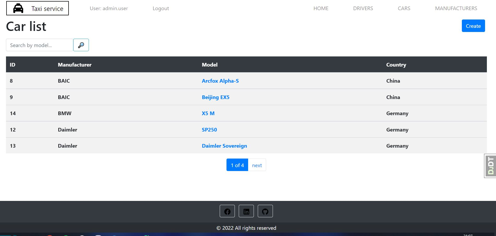

# Taxi service website

Django project to managing taxi service. CRUD functionality with drivers, cars, manufacturers.

## Check it out!
[Taxi project deployed to Heroku](https://taxi-service-django.herokuapp.com/)

```shell
login: test_user
password: test11223344
```

## Installation

Python3 must be already installed

```shell
git clone https://github.com/AlexBOVUKR/taxi-website
cd taxi-website
python3 -m venv venv
source venv/bin/activate(Mac)
source venv/Scripts/activate(Windows)
pip install -r requirements.txt
python manage.py migrate
python manage.py runserver #starts Django server
```

Here you should say what actually happens when you execute the code above.


## Features

* Authentication functionality (Driver/User)
* CRUD operations for each category
* Admin panel for advanced managing

## Demo


